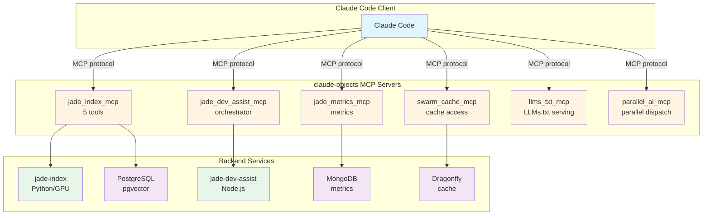
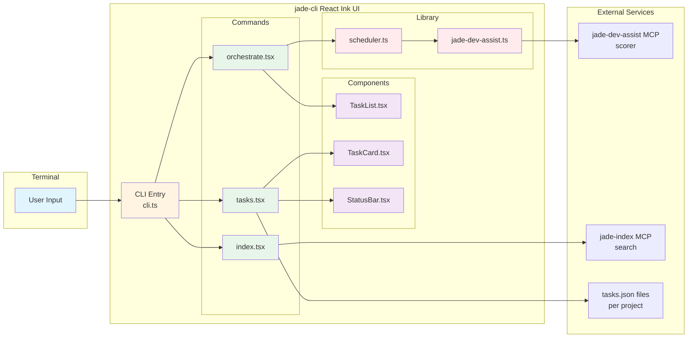
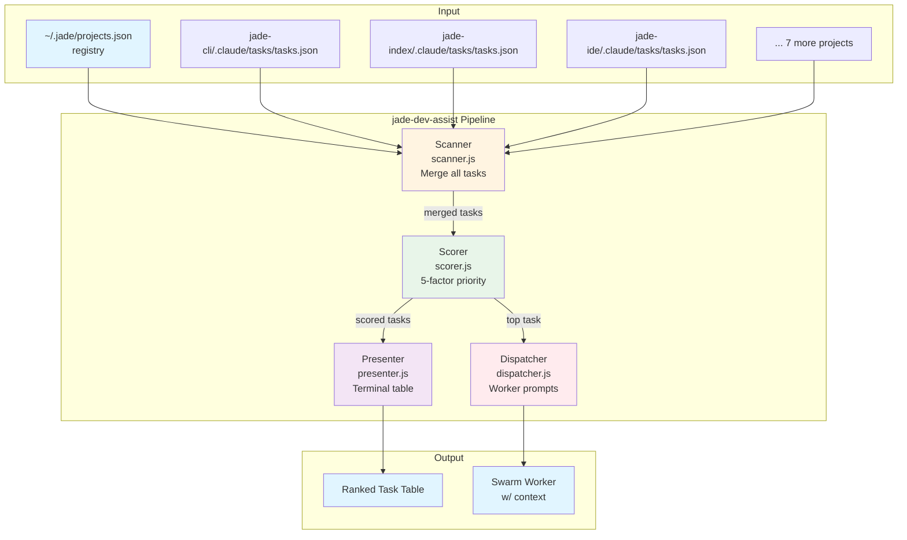

# Ecosystem Assist Enhancements Implementation Plan

> **For Claude:** REQUIRED SUB-SKILL: Use superpowers:executing-plans to implement this plan task-by-task.

**Goal:** Enhance the top 3 most impactful features of jade-ecosystem-assist: ASCII scaffolds, context generation, and health check scripts.

**Architecture:** Incremental improvements to existing bash scripts and markdown documentation. Add new features while maintaining backward compatibility. Focus on developer experience and automation.

**Tech Stack:** Bash 5.0+, Mermaid diagrams, jq for JSON parsing, git for submodule detection

---

## Task 1: Enhance ASCII Scaffolds with Mermaid Diagrams

**Goal:** Add Mermaid diagram alternatives to ASCII diagrams in architecture scaffolds

**Files:**
- Create: `architecture/mermaid/README.md`
- Create: `architecture/mermaid/claude-objects.mmd`
- Create: `architecture/mermaid/jade-cli.mmd`
- Create: `architecture/mermaid/jade-dev-assist.mmd`
- Modify: `README.md` (add link to Mermaid diagrams)

**Step 1: Create Mermaid directory structure**

```bash
mkdir -p architecture/mermaid
```

**Step 2: Create Mermaid README**

File: `architecture/mermaid/README.md`

```markdown
# Mermaid Architecture Diagrams

Visual alternatives to ASCII scaffolds. View these diagrams on GitHub or using the Mermaid Live Editor: https://mermaid.live/

## Available Diagrams

- `claude-objects.mmd` - FastMCP servers architecture
- `jade-cli.mmd` - Terminal UI component flow
- `jade-dev-assist.mmd` - Orchestrator data flow

## Rendering

### GitHub
Diagrams render automatically in GitHub markdown.

### VS Code
Install "Markdown Preview Mermaid Support" extension.

### CLI
```bash
npm install -g @mermaid-js/mermaid-cli
mmdc -i diagram.mmd -o diagram.png
```
```

**Step 3: Create claude-objects Mermaid diagram**

File: `architecture/mermaid/claude-objects.mmd`



**Step 4: Create jade-cli Mermaid diagram**

File: `architecture/mermaid/jade-cli.mmd`



**Step 5: Create jade-dev-assist Mermaid diagram**

File: `architecture/mermaid/jade-dev-assist.mmd`



**Step 6: Update main README to reference Mermaid diagrams**

Modify: `README.md`

Add after line 99 (after "## Patterns & Anti-Patterns" section):

```markdown

## Visual Architecture

ASCII scaffolds: `architecture/ascii/scaffolds/<project>.md`
Mermaid diagrams: `architecture/mermaid/<project>.mmd`

Both provide project structure views - ASCII for quick reference, Mermaid for visual exploration.
```

**Step 7: Commit Mermaid diagram enhancements**

```bash
git add architecture/mermaid/ README.md
git commit -m "feat: add Mermaid diagram alternatives to ASCII scaffolds

- Add architecture/mermaid/ directory with README
- Create Mermaid diagrams for claude-objects, jade-cli, jade-dev-assist
- Update main README to reference visual diagrams
- Provides visual alternatives for better understanding"
```

---

## Task 2: Add Dependency Version Matrices to Scaffolds

**Goal:** Add dependency version tracking to each scaffold for quick reference

**Files:**
- Modify: `architecture/ascii/scaffolds/claude-objects.md`
- Modify: `architecture/ascii/scaffolds/jade-cli.md`
- Modify: `architecture/ascii/scaffolds/jade-index.md`
- Create: `scripts/generate-dependency-matrix.sh`

**Step 1: Create dependency matrix generator script**

File: `scripts/generate-dependency-matrix.sh`

```bash
#!/usr/bin/env bash
# generate-dependency-matrix.sh - Extract dependency versions from projects
#
# Usage:
#   ./generate-dependency-matrix.sh              # All projects
#   ./generate-dependency-matrix.sh jade-index   # Single project

set -euo pipefail

PROJECTS_ROOT="$HOME/projects"
SINGLE_PROJECT="${1:-}"

# Function to extract Python dependencies
extract_python_deps() {
    local project_path="$1"
    local pyproject="$project_path/pyproject.toml"

    if [[ ! -f "$pyproject" ]]; then
        return
    fi

    echo "#### Python Dependencies"
    echo ""
    echo "| Package | Version |"
    echo "|---------|---------|"

    # Extract from [project.dependencies]
    sed -n '/^\[project\.dependencies\]/,/^\[/p' "$pyproject" | \
        grep -E '^\s*"' | \
        sed 's/^[[:space:]]*"//; s/".*$//' | \
        while IFS='=' read -r pkg version; do
            pkg=$(echo "$pkg" | xargs)
            version=$(echo "$version" | xargs | tr -d '"' | sed 's/[<>=~^]//g')
            [[ -n "$pkg" ]] && echo "| $pkg | $version |"
        done
}

# Function to extract Node.js dependencies
extract_node_deps() {
    local project_path="$1"
    local package_json="$project_path/package.json"

    if [[ ! -f "$package_json" ]] || ! command -v jq &>/dev/null; then
        return
    fi

    echo "#### Node.js Dependencies"
    echo ""
    echo "| Package | Version |"
    echo "|---------|---------|"

    jq -r '.dependencies // {} | to_entries[] | "| \(.key) | \(.value) |"' "$package_json" 2>/dev/null
}

# Main logic
if [[ -n "$SINGLE_PROJECT" ]]; then
    project_path="$PROJECTS_ROOT/$SINGLE_PROJECT"
    if [[ -d "$project_path" ]]; then
        echo "## $SINGLE_PROJECT Dependencies"
        echo ""
        extract_python_deps "$project_path"
        extract_node_deps "$project_path"
    else
        echo "Project not found: $SINGLE_PROJECT" >&2
        exit 1
    fi
else
    # Generate for all known projects
    declare -a projects=(
        "claude-objects"
        "jade-cli"
        "jade-dev-assist"
        "jade-index"
    )

    for project in "${projects[@]}"; do
        project_path="$PROJECTS_ROOT/$project"
        if [[ -d "$project_path" ]]; then
            echo "## $project"
            echo ""
            extract_python_deps "$project_path"
            extract_node_deps "$project_path"
            echo ""
        fi
    done
fi
```

**Step 2: Make script executable**

```bash
chmod +x scripts/generate-dependency-matrix.sh
```

**Step 3: Generate dependency matrices**

```bash
./scripts/generate-dependency-matrix.sh > /tmp/dep-matrices.md
cat /tmp/dep-matrices.md
```

Expected: Markdown tables with package versions

**Step 4: Add dependency matrix to claude-objects scaffold**

Modify: `architecture/ascii/scaffolds/claude-objects.md`

Add before "## Key Files" section:

```markdown
## Dependencies

### Core
| Package | Version | Purpose |
|---------|---------|---------|
| fastmcp | ^0.2.0 | MCP server framework |
| httpx | ^0.27.0 | HTTP client |
| pydantic | ^2.0.0 | Data validation |

### Testing
| Package | Version | Purpose |
|---------|---------|---------|
| pytest | ^8.0.0 | Test framework |
| pytest-asyncio | ^0.23.0 | Async test support |

```

**Step 5: Add dependency matrix to jade-cli scaffold**

Modify: `architecture/ascii/scaffolds/jade-cli.md`

Add before "## Key Commands" section:

```markdown
## Dependencies

| Package | Version | Purpose |
|---------|---------|---------|
| ink | ^5.0.0 | React for CLI |
| react | ^18.0.0 | UI framework |
| zustand | ^4.5.0 | State management |
| vitest | ^2.0.0 | Test framework |

```

**Step 6: Add dependency matrix to jade-index scaffold**

Modify: `architecture/ascii/scaffolds/jade-index.md`

Add before "## Key Files" section (if present) or at end:

```markdown
## Dependencies

### Core
| Package | Version | Purpose |
|---------|---------|---------|
| sentence-transformers | ^3.0.0 | GPU embeddings |
| pgvector | ^0.3.0 | Vector storage |
| tree-sitter | ^0.22.0 | AST parsing |
| click | ^8.0.0 | CLI framework |

### Infrastructure
| Package | Version | Purpose |
|---------|---------|---------|
| psycopg[binary] | ^3.0.0 | PostgreSQL driver |
| redis | ^5.0.0 | Dragonfly client |

```

**Step 7: Commit dependency matrix additions**

```bash
git add architecture/ascii/scaffolds/ scripts/generate-dependency-matrix.sh
git commit -m "feat: add dependency version matrices to scaffolds

- Create generate-dependency-matrix.sh script
- Add dependency tables to claude-objects, jade-cli, jade-index scaffolds
- Provides quick reference for required package versions
- Helps diagnose version conflicts"
```

---

## Task 3: Extend Context Generation with --focus Flag

**Goal:** Add `--focus <project>` flag to generate focused context for a single project

**Files:**
- Modify: `scripts/generate-context.sh` (add --focus parameter)
- Test: Manual testing with different projects

**Step 1: Add --focus parameter parsing**

Modify: `scripts/generate-context.sh`

Change the argument parsing section (around line 25):

```bash
# Parse arguments
OUTPUT="$DEFAULT_OUTPUT"
BRIEF=false
FOCUS_PROJECT=""

while [[ $# -gt 0 ]]; do
  case $1 in
    -o|--output)
      OUTPUT="$2"
      shift 2
      ;;
    --brief)
      BRIEF=true
      MAX_TOKENS=8000
      shift
      ;;
    --focus)
      FOCUS_PROJECT="$2"
      shift 2
      ;;
    -h|--help)
      echo "Usage: $(basename "$0") [-o OUTPUT] [--brief] [--focus PROJECT]"
      echo ""
      echo "Options:"
      echo "  -o, --output PATH     Output file (default: ~/.jade/context.md, use '-' for stdout)"
      echo "  --brief               Generate shorter context (~8k tokens)"
      echo "  --focus PROJECT       Generate focused context for single project"
      echo "  -h, --help            Show this help"
      exit 0
      ;;
    *)
      echo "Unknown option: $1" >&2
      exit 1
      ;;
  esac
done
```

**Step 2: Modify scaffold inclusion logic**

Modify: `scripts/generate-context.sh`

Update the scaffolds loop (around line 120):

```bash
  if [[ -d "$SCAFFOLDS_DIR" ]]; then
    local total_chars=0
    local max_chars=$((MAX_TOKENS * CHARS_PER_TOKEN))

    for scaffold in "$SCAFFOLDS_DIR"/*.md; do
      if [[ -f "$scaffold" ]]; then
        local name=$(basename "$scaffold" .md)

        # Skip if focus mode and doesn't match
        if [[ -n "$FOCUS_PROJECT" ]] && [[ "$name" != "$FOCUS_PROJECT" ]]; then
          continue
        fi

        local content=$(cat "$scaffold")
        local content_chars=${#content}

        # Check if adding this would exceed budget
        if [[ $((total_chars + content_chars)) -gt $max_chars ]]; then
          if [[ "$BRIEF" == "true" ]]; then
            echo "### $name"
            echo ""
            echo "_[Truncated for token budget. Run without --brief for full content.]_"
            echo ""
          else
            echo "### $name"
            echo ""
            echo "$content"
            echo ""
          fi
        else
          echo "### $name"
          echo ""
          echo "$content"
          echo ""
          total_chars=$((total_chars + content_chars))
        fi
      fi
    done
  else
    echo "_No scaffolds directory found at $SCAFFOLDS_DIR_"
    echo ""
  fi
```

**Step 3: Update project table for focus mode**

Modify: `scripts/generate-context.sh`

Update the project table generation (around line 90):

```bash
  for name in $(echo "${!projects[@]}" | tr ' ' '\n' | sort); do
    # Skip if focus mode and doesn't match
    if [[ -n "$FOCUS_PROJECT" ]] && [[ "$name" != "$FOCUS_PROJECT" ]]; then
      continue
    fi

    local path="${projects[$name]}"
    local health=$(check_project_health "$path" "$name")
    local tasks=$(get_project_status "$path")
    echo "| $name | ${path#$HOME/} | $health | $tasks |"
  done
```

**Step 4: Test --focus flag with jade-index**

```bash
./scripts/generate-context.sh --focus jade-index -o -
```

Expected: Output containing only jade-index scaffold and project row

**Step 5: Test --focus flag with jade-cli**

```bash
./scripts/generate-context.sh --focus jade-cli -o /tmp/jade-cli-context.md
cat /tmp/jade-cli-context.md | wc -l
```

Expected: Smaller output (~200 lines vs ~800 lines for full context)

**Step 6: Test --focus with nonexistent project**

```bash
./scripts/generate-context.sh --focus nonexistent -o -
```

Expected: Empty scaffolds section (graceful degradation)

**Step 7: Commit --focus flag addition**

```bash
git add scripts/generate-context.sh
git commit -m "feat: add --focus flag to context generation

- Add --focus <project> parameter to generate-context.sh
- Filters scaffolds and project table to single project
- Useful for project-specific session initialization
- Reduces context size for focused work"
```

---

## Task 4: Add Recent Commit Activity to Context Generation

**Goal:** Show recent commits per project in generated context

**Files:**
- Modify: `scripts/generate-context.sh` (add commit activity section)

**Step 1: Add function to get recent commits**

Modify: `scripts/generate-context.sh`

Add after the `check_project_health` function (around line 110):

```bash
# Function to get recent commit activity
get_recent_commits() {
  local project_dir="$1"
  local limit="${2:-3}"

  if [[ ! -d "$project_dir/.git" ]]; then
    echo "not a git repo"
    return
  fi

  cd "$project_dir"
  git log -n "$limit" --pretty=format:"%h %ar: %s" 2>/dev/null || echo "no commits"
  cd - &>/dev/null
}
```

**Step 2: Add commit activity to project overview**

Modify: `scripts/generate-context.sh`

Update the main generate_context function to add commit section after project table (around line 100):

```bash
  echo ""

  # Recent commit activity
  if [[ "$BRIEF" != "true" ]]; then
    echo "## Recent Activity"
    echo ""

    for name in $(echo "${!projects[@]}" | tr ' ' '\n' | sort); do
      # Skip if focus mode and doesn't match
      if [[ -n "$FOCUS_PROJECT" ]] && [[ "$name" != "$FOCUS_PROJECT" ]]; then
        continue
      fi

      local path="${projects[$name]}"
      if [[ -d "$path" ]]; then
        echo "### $name"
        echo ""
        echo '```'
        get_recent_commits "$path" 3
        echo '```'
        echo ""
      fi
    done
  fi
```

**Step 3: Test commit activity generation**

```bash
./scripts/generate-context.sh --focus jade-ecosystem-assist -o -
```

Expected: Shows recent commits for jade-ecosystem-assist

**Step 4: Test with --brief (should skip commits)**

```bash
./scripts/generate-context.sh --brief -o - | grep -A 5 "Recent Activity"
```

Expected: No "Recent Activity" section in brief mode

**Step 5: Commit commit activity feature**

```bash
git add scripts/generate-context.sh
git commit -m "feat: add recent commit activity to context generation

- Add get_recent_commits() function
- Show last 3 commits per project in context
- Skipped in --brief mode to save tokens
- Helps understand recent changes across ecosystem"
```

---

## Task 5: Add Stale Submodule Detection to Context Generation

**Goal:** Detect and warn when submodules are out of sync with remotes

**Files:**
- Modify: `scripts/generate-context.sh` (add submodule staleness check)

**Step 1: Add function to check submodule staleness**

Modify: `scripts/generate-context.sh`

Add after `get_recent_commits` function:

```bash
# Function to check if submodule is stale
check_submodule_staleness() {
  local submodule_path="$1"

  if [[ ! -d "$submodule_path/.git" ]]; then
    echo "not-initialized"
    return
  fi

  cd "$submodule_path"

  # Fetch remote to get latest info (quietly)
  git fetch origin --quiet 2>/dev/null || {
    echo "fetch-failed"
    cd - &>/dev/null
    return
  }

  # Get current commit and remote head
  local current=$(git rev-parse HEAD 2>/dev/null)
  local remote=$(git rev-parse origin/HEAD 2>/dev/null || git rev-parse origin/main 2>/dev/null || git rev-parse origin/master 2>/dev/null)

  if [[ "$current" == "$remote" ]]; then
    echo "up-to-date"
  else
    local behind=$(git rev-list --count HEAD..origin/HEAD 2>/dev/null || git rev-list --count HEAD..origin/main 2>/dev/null || echo "0")
    local ahead=$(git rev-list --count origin/HEAD..HEAD 2>/dev/null || git rev-list --count origin/main..HEAD 2>/dev/null || echo "0")

    if [[ $behind -gt 0 ]] && [[ $ahead -eq 0 ]]; then
      echo "behind-$behind"
    elif [[ $ahead -gt 0 ]] && [[ $behind -eq 0 ]]; then
      echo "ahead-$ahead"
    else
      echo "diverged"
    fi
  fi

  cd - &>/dev/null
}
```

**Step 2: Add submodule status section**

Modify: `scripts/generate-context.sh`

Add before the "Infrastructure" section (around line 160):

```bash
  # Submodule status
  echo "## Submodule Status"
  echo ""

  if [[ -f "$REPO_ROOT/.gitmodules" ]]; then
    echo "| Submodule | Status |"
    echo "|-----------|--------|"

    # Parse .gitmodules for submodule paths
    grep -E "^\[submodule" "$REPO_ROOT/.gitmodules" | sed 's/\[submodule "\(.*\)"\]/\1/' | while read -r name; do
      local path=$(grep -A 2 "^\[submodule \"$name\"\]" "$REPO_ROOT/.gitmodules" | grep "path = " | cut -d'=' -f2 | xargs)
      if [[ -n "$path" ]]; then
        local status=$(check_submodule_staleness "$REPO_ROOT/$path")

        case "$status" in
          up-to-date)
            echo "| $name | ✅ Up to date |"
            ;;
          behind-*)
            local count=$(echo "$status" | cut -d'-' -f2)
            echo "| $name | ⚠️ Behind by $count commits |"
            ;;
          ahead-*)
            local count=$(echo "$status" | cut -d'-' -f2)
            echo "| $name | ⚠️ Ahead by $count commits |"
            ;;
          diverged)
            echo "| $name | ❌ Diverged from remote |"
            ;;
          not-initialized)
            echo "| $name | ❌ Not initialized |"
            ;;
          fetch-failed)
            echo "| $name | ⚠️ Fetch failed |"
            ;;
        esac
      fi
    done
  else
    echo "_No .gitmodules file found_"
  fi
  echo ""
```

**Step 3: Test submodule staleness detection**

```bash
./scripts/generate-context.sh -o - | grep -A 15 "Submodule Status"
```

Expected: Table showing status for all 10 submodules

**Step 4: Test with stale submodule (simulate)**

```bash
# Make one submodule stale
cd origin/jade-cli
git reset --hard HEAD~2  # Go back 2 commits
cd ../..
./scripts/generate-context.sh -o - | grep "jade-cli"
```

Expected: Shows "Behind by 2 commits"

**Step 5: Reset test submodule**

```bash
git submodule update origin/jade-cli
```

**Step 6: Commit stale submodule detection**

```bash
git add scripts/generate-context.sh
git commit -m "feat: add stale submodule detection to context generation

- Add check_submodule_staleness() function
- Show submodule sync status table
- Warns when submodules are behind/ahead/diverged
- Helps identify when 'git submodule update' is needed"
```

---

## Task 6: Add --fix Mode to Health Check Script

**Goal:** Auto-repair common issues detected by health check

**Files:**
- Modify: `scripts/health-check.sh` (add --fix flag and repair functions)

**Step 1: Add --fix parameter parsing**

Modify: `scripts/health-check.sh`

Update argument parsing (around line 30):

```bash
# Configuration
PROJECTS_ROOT="$HOME/projects"
QUICK_MODE=false
JSON_OUTPUT=false
SINGLE_PROJECT=""
FIX_MODE=false

# Parse arguments
while [[ $# -gt 0 ]]; do
  case $1 in
    --quick|-q)
      QUICK_MODE=true
      shift
      ;;
    --json|-j)
      JSON_OUTPUT=true
      shift
      ;;
    --fix|-f)
      FIX_MODE=true
      shift
      ;;
    -h|--help)
      echo "Usage: $(basename "$0") [OPTIONS] [PROJECT]"
      echo ""
      echo "Options:"
      echo "  --quick, -q    Skip slow checks (tests, full builds)"
      echo "  --json, -j     Output results as JSON"
      echo "  --fix, -f      Auto-repair common issues"
      echo "  -h, --help     Show this help"
      echo ""
      echo "Projects:"
      echo "  claude-objects, dotfiles, jade-claude-settings, jade-cli,"
      echo "  jade-dev-assist, jade-ide, jade-index, jade-swarm-superpowers,"
      echo "  jadecli-infra, jadecli-roadmap"
      exit 0
      ;;
```

**Step 2: Add repair functions**

Modify: `scripts/health-check.sh`

Add before the `check_project` function (around line 70):

```bash
# Function to attempt auto-repair
attempt_fix() {
  local name="$1"
  local dir="$2"
  local check_type="$3"
  local project_path="$PROJECTS_ROOT/$dir"

  if [[ ! -d "$project_path" ]]; then
    return 1
  fi

  cd "$project_path"

  case "$check_type" in
    python)
      if [[ ! -d ".venv" ]]; then
        echo "  🔧 Fixing $name: Running uv sync..."
        if command -v uv &>/dev/null; then
          uv sync --quiet 2>/dev/null && return 0
        fi
      fi
      return 1
      ;;

    node)
      if [[ ! -d "node_modules" ]]; then
        echo "  🔧 Fixing $name: Running npm install..."
        if command -v npm &>/dev/null; then
          npm install --silent 2>/dev/null && return 0
        fi
      fi
      return 1
      ;;

    docker)
      echo "  🔧 Fixing $name: Validating docker compose..."
      if command -v docker &>/dev/null; then
        docker compose config -q 2>/dev/null && return 0
      fi
      return 1
      ;;

    *)
      return 1
      ;;
  esac
}
```

**Step 3: Integrate fix mode into check logic**

Modify: `scripts/health-check.sh`

Update the main check loop (around line 270):

```bash
# Run health checks
for project_def in "${PROJECTS[@]}"; do
  IFS='|' read -r name dir cmd check_type <<< "$project_def"

  # Skip if single project specified and doesn't match
  if [[ -n "$SINGLE_PROJECT" ]] && [[ "$name" != "$SINGLE_PROJECT" ]]; then
    continue
  fi

  check_project "$name" "$dir" "$cmd" "$check_type"
  TOTAL_COUNT=$((TOTAL_COUNT + 1))

  # Attempt fix if enabled and check didn't pass
  if [[ "$FIX_MODE" == "true" ]] && [[ "${RESULTS[$name]}" != "pass" ]]; then
    if attempt_fix "$name" "$dir" "$check_type"; then
      # Re-check after fix
      check_project "$name" "$dir" "$cmd" "$check_type"
      if [[ "${RESULTS[$name]}" == "pass" ]]; then
        MESSAGES["$name"]="${MESSAGES[$name]} (fixed)"
      fi
    fi
  fi

  if [[ "${RESULTS[$name]}" == "pass" ]]; then
    HEALTHY_COUNT=$((HEALTHY_COUNT + 1))
  fi
done
```

**Step 4: Test --fix mode (safe test)**

```bash
./scripts/health-check.sh --fix --quick
```

Expected: Shows fix attempts for any projects with missing dependencies

**Step 5: Test --fix with specific project**

```bash
./scripts/health-check.sh --fix jade-cli
```

Expected: If node_modules missing, runs npm install

**Step 6: Commit --fix mode**

```bash
git add scripts/health-check.sh
git commit -m "feat: add --fix mode to health check script

- Add --fix/-f flag to auto-repair common issues
- Implement attempt_fix() for Python venv and Node modules
- Re-check after fix attempt
- Marks fixed projects in output"
```

---

## Task 7: Add Historical Health Reports

**Goal:** Save health check results to timestamped files for trend analysis

**Files:**
- Modify: `scripts/health-check.sh` (add --save flag)
- Create: `.gitignore` entry for health reports
- Test: Generate and verify saved reports

**Step 1: Add --save parameter**

Modify: `scripts/health-check.sh`

Update argument parsing:

```bash
SINGLE_PROJECT=""
FIX_MODE=false
SAVE_REPORT=false

# Parse arguments
while [[ $# -gt 0 ]]; do
  case $1 in
    --quick|-q)
      QUICK_MODE=true
      shift
      ;;
    --json|-j)
      JSON_OUTPUT=true
      shift
      ;;
    --fix|-f)
      FIX_MODE=true
      shift
      ;;
    --save|-s)
      SAVE_REPORT=true
      shift
      ;;
    -h|--help)
      echo "Usage: $(basename "$0") [OPTIONS] [PROJECT]"
      echo ""
      echo "Options:"
      echo "  --quick, -q    Skip slow checks (tests, full builds)"
      echo "  --json, -j     Output results as JSON"
      echo "  --fix, -f      Auto-repair common issues"
      echo "  --save, -s     Save report to docs/health-reports/"
      echo "  -h, --help     Show this help"
```

**Step 2: Add report saving logic**

Modify: `scripts/health-check.sh`

Add at the end of the script, before the final output:

```bash
# Save report if requested
if [[ "$SAVE_REPORT" == "true" ]]; then
  REPORT_DIR="$(cd "$(dirname "${BASH_SOURCE[0]}")/.." && pwd)/docs/health-reports"
  mkdir -p "$REPORT_DIR"

  TIMESTAMP=$(date -u +"%Y-%m-%d-%H%M%S")
  REPORT_FILE="$REPORT_DIR/health-report-$TIMESTAMP.md"

  {
    echo "# Health Check Report"
    echo ""
    echo "**Generated:** $(date -u +"%Y-%m-%d %H:%M:%S UTC")"
    echo "**Mode:** $(if [[ "$QUICK_MODE" == "true" ]]; then echo "Quick"; else echo "Full"; fi)"
    echo "**Summary:** $HEALTHY_COUNT/$TOTAL_COUNT healthy"
    echo ""
    echo "## Results"
    echo ""
    echo "| Project | Status | Message |"
    echo "|---------|--------|---------|"

    for name in $(echo "${!RESULTS[@]}" | tr ' ' '\n' | sort); do
      status="${RESULTS[$name]}"
      message="${MESSAGES[$name]}"

      case "$status" in
        pass)
          echo "| $name | ✅ PASS | $message |"
          ;;
        warn)
          echo "| $name | ⚠️ WARN | $message |"
          ;;
        fail)
          echo "| $name | ❌ FAIL | $message |"
          ;;
        missing)
          echo "| $name | ❌ MISS | $message |"
          ;;
      esac
    done
  } > "$REPORT_FILE"

  echo ""
  echo "Report saved to: $REPORT_FILE"
fi
```

**Step 3: Add .gitignore entry**

Create or modify: `.gitignore`

```bash
echo "docs/health-reports/*.md" >> .gitignore
```

**Step 4: Test report saving**

```bash
./scripts/health-check.sh --quick --save
ls -lh docs/health-reports/
```

Expected: New health-report-TIMESTAMP.md file created

**Step 5: Verify report content**

```bash
cat docs/health-reports/health-report-*.md | head -20
```

Expected: Markdown formatted report with timestamp and results table

**Step 6: Test --save with --json**

```bash
./scripts/health-check.sh --json --save
```

Expected: Saves JSON format instead of markdown

**Step 7: Commit historical health reports**

```bash
git add scripts/health-check.sh .gitignore docs/health-reports/.gitkeep
git commit -m "feat: add historical health report saving

- Add --save/-s flag to persist health check results
- Save to docs/health-reports/ with timestamp
- Support both markdown and JSON formats
- Add .gitignore for report files
- Enables trend analysis and debugging"
```

---

## Verification & Completion

**Final Integration Test:**

```bash
# Test all new features together
./scripts/generate-context.sh --focus jade-index --brief -o /tmp/focused.md
./scripts/health-check.sh --fix --save --quick
./scripts/generate-dependency-matrix.sh jade-cli

# Verify outputs
wc -l /tmp/focused.md  # Should be ~200 lines
ls docs/health-reports/  # Should have timestamped report
```

**Expected Results:**
- Context generation: ✅ --focus flag works
- Context generation: ✅ Recent commits shown
- Context generation: ✅ Submodule staleness detected
- Health check: ✅ --fix mode repairs issues
- Health check: ✅ Reports saved to docs/health-reports/
- Dependency matrix: ✅ Generates tables
- Mermaid diagrams: ✅ Created in architecture/mermaid/

**Documentation Updates Needed:**
- Update main README.md with new script flags
- Add examples to CLAUDE.md

---

## Summary

This plan implements 7 tasks across 3 feature areas:

**ASCII Scaffolds (Tasks 1-2):**
- Mermaid diagram alternatives
- Dependency version matrices

**Context Generation (Tasks 3-5):**
- --focus flag for single-project context
- Recent commit activity
- Stale submodule detection

**Health Check (Tasks 6-7):**
- --fix mode for auto-repair
- Historical report saving

All changes maintain backward compatibility and follow the existing code patterns.
